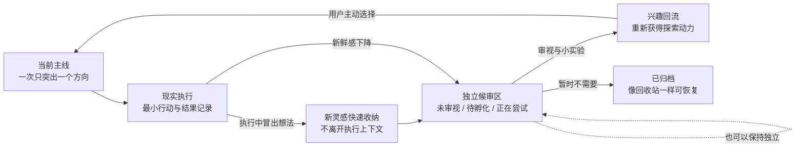

# ENTP 自强手册

<p align="center">
  
</p>

<p align="center">
  <strong>好奇心动力回流系统</strong><br>
  不阻止发散，而是让发散暂存；不追求想通，而是让好奇心重新回到现实行动。
</p>

<p align="center">
  Python · Flet · SQLite · Markdown · Windows
</p>

## 为什么做这个项目

有一类人并不缺想法，也不缺分析能力，真正困难的是把兴趣持续带进现实：

- 在脑中想通方案时，已经提前获得了“完成感”，真正执行反而显得乏味。
- 新灵感比旧任务更有刺激性，于是不断切换方向。
- 为了不忘记可能性，什么都放在眼前，最后所有选择一起争夺注意力。
- 新鲜感下降时，容易把“暂时没动力”误判成“这个选择错了”。
- 普通待办工具擅长管理任务，却很少处理“发散如何不打断执行，又能在之后重新成为动力”。

ENTP 自强手册由此只做一件事：

> 把执行和发散分开，让新想法安全离场；当动力下降时，再通过审视灵感找回兴趣，并把兴趣转化为一次现实尝试。

这里的 “ENTP” 是一种产品隐喻，不是人格诊断。任何想法很多、容易切换、需要保护好奇心同时又想稳定推进的人，都可以使用它。

## 核心循环



灵感不必证明自己“对当前主线有用”。它可以保持独立、继续孵化、做一次小实验，或者进入归档。只有用户主动选择时，它才回到主线；系统不替用户强行建立意义。

## 三个关键区分

### 想通了，不等于做过了

软件把思考完成与现实完成分开：

- 灵感和分析进入候审区。
- 任务被改写为下一步最小行动。
- 每次执行记录“做了什么、发生了什么、接下来做什么”。
- 完成必须落在一个真实日期上，而不是只改变当前界面的状态。

### 可以有多条主线，但执行时只看一条

保留可能性本身没有错，问题是让所有可能性同时出现在执行现场。

- “当前主线”只显示正在选择的方向。
- 其他主线进入“我的主线任务保管箱”。
- 切换、归档和恢复都不会删除任务或 Markdown。
- 时间限制与复盘日期完全可选，默认不倒计时、不制造压力。

### “今天”是历史事实，不是永久标签

今日清单不是简单的 `is_today = true`：

- 每一天都有独立账本。
- 完成、重新打开和结转都会写入事件。
- 任务以后改名，也不会篡改过去的标题快照。
- 昨天没有完成的任务不会在午夜后自动伪装成今天；用户需要主动顺延。
- 完成日历记录真实发生过的完成事实，不计算连续打卡天数。

## 主要功能

### 当前主线与执行

- 保存多条主线，但执行区只突出一条当前主线。
- 当前主线下可以创建多个任务，同时突出一个当前推进任务。
- 顶部输入框回车即可创建任务，不弹出表单。
- 任务详情提供自由正文与“下一步最小行动”。
- 逐次记录行动、结果和新的下一步。
- “没动力了”不是报错或失败，而是进入候审区重新接触兴趣的入口。
- 执行中可以一行暂存新灵感，保存后立即回到当前任务。

### 候审区

- 灵感默认独立，不强迫关联主线。
- 活动看板只有“未审视 / 待孵化 / 正在尝试”。
- 卡片上的孵化、尝试和归档图标都可单击完成，不使用状态下拉框。
- 单条灵感只有标题、自由标签和空白 Markdown 正文，不预设类别或思考模板。
- “已归档”是独立回收站，不参与日常候审，内容可以恢复。

### 今日清单与完成日历

- 今日页汇总所有主线和收集箱中的当日任务。
- 支持回车快速添加、分组折叠、优先级排序、完成、恢复和过期顺延。
- 可以回看前后日期，也可以从月历跳转。
- 完成日历按月展示完成分布，点击日期查看任务及真实完成时间。
- 历史记录保存标题与主线快照，不被后续编辑覆盖。

### 本地数据与 Markdown

- SQLite 保存关系、状态、事件和日期账本。
- 每条主线、任务、灵感、执行记录和每日账本都对应独立 Markdown 文件。
- Markdown 中的系统同步区由程序更新，自由记录区不会被覆盖。
- 可以交给 MarkText 或系统默认 Markdown 应用继续编辑。
- 支持完整导出与导入；导入前会先备份当前工作区并校验文件清单。

### Windows 桌面体验

- 响应式 Flet 桌面界面，窄窗口会重排结构而不是缩小字体。
- 可以隐藏窗口和任务栏图标，在系统托盘继续运行。
- 安装时可选“登录 Windows 后在后台启动”。
- 开始菜单和 Windows“已安装的应用”均提供卸载入口。
- 统一异常边界：一次操作失败会提示并写入日志，不让整个窗口随之崩溃。

## 界面

| 当前主线 | 候审区 |
|---|---|
|  |  |

| 今日清单 | 完成日历 |
|---|---|
|  |  |

## 初始化工作区

第一次打开全新数据库时，程序不会给用户一张毫无提示的空白页，也不会弹出强制教程。它会生成一套可以直接操作的介绍数据：

- 当前主线介绍单一焦点、最小行动和执行记录。
- 另一条主线介绍保管箱、切换、归档与恢复。
- 今日任务介绍快速输入、任务详情、收集箱和 Markdown。
- 灵感卡片覆盖未审视、待孵化、正在尝试和已归档。
- 今天与昨天各有完成示例，用来解释每日账本和完成日历。

这些都是普通数据，可以直接修改、完成或归档。初始化只在数据库完全为空时执行一次；升级和再次启动不会重复写入，更不会覆盖已有数据。

## 安装与运行

### Windows 安装版

本地构建产物为：

```text
release/ENTP自强手册_2.0.0_初始化版.exe
```

安装器支持选择安装目录、桌面快捷方式、可选的登录后后台启动和完整卸载。安装版个人数据保存在：

```text
%LOCALAPPDATA%\ENTP自强手册
```

卸载默认保留数据库和 Markdown，避免误删个人记录。详细行为见 [WINDOWS_INSTALLER.md](WINDOWS_INSTALLER.md)。

### 从源码运行

环境：Windows、Python 3.12。

```powershell
git clone https://github.com/TANGuoGUO/entp-manual.git
cd entp-manual
python -m venv .venv
.\.venv\Scripts\python.exe -m pip install -r requirements-flet.txt
.\.venv\Scripts\python.exe flet_app.py
```

也可以双击：

- `启动_ENTP自强手册.vbs`：无命令行黑框。
- `启动_ENTP自强手册.bat`：保留命令行输出，适合排查问题。

### 构建 Windows 安装包

需要 Inno Setup 6：

```powershell
.\.venv\Scripts\python.exe -m pip install -r requirements-build.txt
powershell.exe -NoProfile -ExecutionPolicy Bypass -File .\installer\build_installer.ps1
```

## 数据与备份

进入“我的主线任务保管箱”，选择“导出全部”，即可生成 `.entp.zip` 完整备份，内容包括：

- SQLite 数据库中的主线、任务、每日账本、完成事件、灵感和执行记录。
- `markdown/` 下的所有自由笔记。
- 用于导入校验的格式版本、文件大小与 SHA-256 清单。

导入采用整体恢复而不是模糊合并，避免重复任务、关系错位和历史日期被污染。恢复前程序会自动保存当前工作区。

## 技术结构

```text
flet_app.py             Flet 桌面界面与交互
database.py             SQLite 模型、迁移、每日账本和事件
markdown_store.py       对象与 Markdown 双向保留规则
backup_service.py       完整导出、校验、回滚与恢复
installer/              Inno Setup 安装与卸载脚本
tests/                  单元、数据契约和桌面 E2E 测试
PRODUCT_DESIGN.md       完整产品理念、日期机制与设计取舍
```

当前版本使用 Python、Flet、SQLite、Pillow 与 pystray。第三方组件及许可证说明见 [THIRD_PARTY_NOTICES.md](THIRD_PARTY_NOTICES.md)。

## 测试

```powershell
.\.venv\Scripts\python.exe -m unittest discover -s tests -p "test_*.py"
```

当前自动化覆盖数据库约束、日期更迭、完成历史、主线归档、灵感回收站、导入导出、异常隔离、托盘状态、安装资源以及真实 Flet 控件回调。测试设计和最近一次报告分别见 [TEST_PLAN.md](TEST_PLAN.md) 与 [TEST_REPORT.md](TEST_REPORT.md)。

## 产品边界

第一版刻意不同时解决情绪翻译、关系沟通和人生选择。它们虽然与 ENTP 的困境有关，但全部塞进来只会让产品变成泛心理记录工具。

当前目标始终是：

> 保护发散，隔离干扰；记录现实，把好奇心重新送回行动。

更完整的机制、日期模型和设计取舍见 [PRODUCT_DESIGN.md](PRODUCT_DESIGN.md)。
