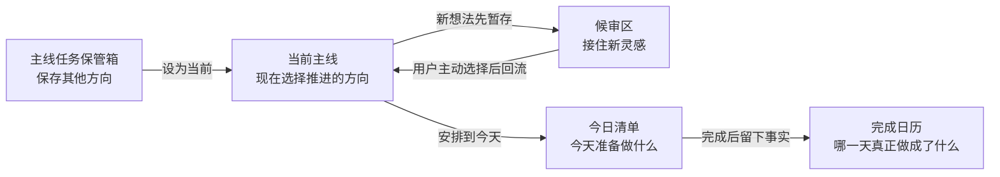

# ENTP 自强手册

<p align="center">
  
</p>

<p align="center">
  <strong>一个帮助“想法很多，但容易被新鲜感带走”的人持续推进事情的 Windows 桌面工具。</strong>
</p>

<p align="center">
  <a href="https://github.com/TANGuoGUO/entp-manual/releases/latest/download/ENTP-Manual-2.0.0-Setup.exe">下载 Windows 安装版</a>
  ·
  <a href="PRODUCT_DESIGN.md">产品设计</a>
  ·
  <a href="WINDOWS_INSTALLER.md">安装说明</a>
</p>

## 先看重点：它能帮你做什么

你可以有很多想法，也可以保存多条主线，但真正执行时，软件只让一条主线留在眼前。

| 当你遇到…… | 软件会怎么接住 | 你实际会看到什么 |
|---|---|---|
| 同时想做很多事，不知道先推哪一个 | 其他方向不删除，只暂时移出执行视野 | **当前主线**与**我的主线任务保管箱** |
| 新想法突然出现，打断手上的任务 | 先用一句话收起来，不要求立刻整理 | 当前主线里的**暂存新灵感** |
| 新鲜感下降，对手上的事没动力 | 去看候审区里的灵感，重新接触真正让你感兴趣的东西 | **没动力了**与**候审区** |
| 想了很多，却说不清自己实际做过什么 | 把任务缩成下一步，并逐次留下行动和结果 | **当前推进任务**与**记录一次执行** |
| 到了第二天，不记得昨天完成了什么 | 按日期保存当天计划、完成和结转事实 | **今日清单**与**完成日历** |
| 记录被困在某个软件里 | 每个对象都同步为普通 Markdown 文件 | 主线、任务、灵感和每日账本的独立文档 |

它不是靠提醒、倒计时和连续打卡逼你坚持。它更像一个注意力缓冲层：让灵感有地方去，让当前任务有空间继续，让过去真正发生过的行动不会消失。

## 下载 Windows 初始化版

点击 [直接下载 Windows 安装版](https://github.com/TANGuoGUO/entp-manual/releases/latest/download/ENTP-Manual-2.0.0-Setup.exe)，或进入 [GitHub Releases](https://github.com/TANGuoGUO/entp-manual/releases/latest) 查看版本说明。

```text
ENTP-Manual-2.0.0-Setup.exe
```

安装时可以选择：

- 安装目录。
- 是否创建桌面快捷方式。
- 是否在登录 Windows 后于后台启动。

程序可以隐藏窗口和任务栏图标，在系统托盘继续运行。开始菜单和 Windows“已安装的应用”都提供卸载入口。

安装版的个人数据保存在 `%LOCALAPPDATA%\ENTP自强手册`。卸载程序默认保留数据库与 Markdown，避免误删记录。

## 第一次打开，怎么开始

初始化版不会用一连串弹窗教你，也不会只留下一张令人无从下手的空白页。第一次打开时，页面中的主线、任务、灵感和日历记录都在介绍软件本身。

建议按这个顺序体验：

1. **先看“当前主线”**

   页面只展示正在推进的一条主线。示例任务会告诉你快速添加、任务详情、执行记录和 Markdown 在哪里。

2. **把一个示例任务改成你真正要做的事**

   点击任务即可打开详情。标题和正文可以自由填写；“下一步最小行动”只需要写一个现在能开始的动作。

3. **执行一点点，然后点“记录一次执行”**

   记录你实际做了什么、得到什么结果，以及新的下一步。这里不要求第一次就把整件事做完。

4. **冒出新想法时，点“暂存新灵感”**

   写一句话、按回车，新想法会进入候审区。你不会被迫离开当前任务，也不用当场判断它属于哪条主线。

5. **没动力时，点“没动力了”**

   这里的“没动力”不是报错，也不是宣布放弃。它会带你进入候审区，看看哪些灵感还能重新点燃兴趣。

6. **完成任务后打勾**

   完成会进入当天账本和完成日历。即使以后重新打开任务，曾经完成过的事实也不会被抹掉。

初始化内容都是普通数据。看懂以后，可以直接改写、完成、归档或保留，不需要执行“退出教程”。它只在全新空数据库中生成一次，不会覆盖已有数据。

## 五个页面是什么关系



### 当前主线

执行发生在这里：

- 一次只显示一条当前主线。
- 一条主线下可以有多个任务。
- 同时突出一个当前推进任务。
- 可以快速添加任务、修改最小下一步、记录执行结果。
- 新灵感可以原地收纳，不需要跳走。

### 我的主线任务保管箱

这里保存“不是现在，但也不想丢掉”的方向：

- 查看所有主线及其任务。
- 主动把某条主线设为当前主线。
- 归档与恢复主线；归档不会删除任务和 Markdown。
- 导出或导入完整工作空间。

执行页不并列展示这些主线，是为了避免每次打开软件都重新经历一遍选择。

### 候审区

这里不是另一个任务清单，而是独立的灵感池：

- **未审视**：刚记下来，还没有决定怎么处理。
- **待孵化**：仍然有兴趣，但现在不开始。
- **正在尝试**：已经愿意为它做一次低成本实验。
- **已归档**：暂时退出注意力，像回收站一样可以恢复。

每张卡片可以直接点小图标完成孵化、尝试或归档，不需要反复操作下拉框。展开后只有标题、自由标签和 Markdown 正文；软件不预设类别，也不替你回答“这个想法为什么重要”。

### 今日清单

这里回答的是“这一天发生了什么”，而不是“任务现在是什么状态”：

- 汇总各条主线与收集箱的今日任务。
- 支持回车添加、完成、恢复、折叠和过期顺延。
- 可以查看前一天、后一天或从月历选择日期。
- 昨天未完成的内容不会在午夜后自动冒充今天。

### 完成日历

这里保留现实完成，而不是连续打卡：

- 按月显示哪些日期有完成记录。
- 点击某天可以看到完成的任务与真实完成时间。
- 任务后来改名或重新打开，不会篡改过去的完成事实。

## 一天中的实际使用方式

```text
打开当前主线
    ↓
选择一个下一步最小行动
    ↓
实际做一点，并记录结果
    ├── 冒出新想法 → 一句话暂存到候审区 → 回来继续
    ├── 新鲜感下降 → 审视灵感 → 找到兴趣后继续或做小实验
    └── 完成任务 → 写入当天账本和完成日历
```

候审区不要求每天清空。灵感也不必都转成任务。产品希望减少的是执行中的切换，不是人的发散本身。

## 为什么这样设计

### 想通了，不等于现实完成

脑中形成完整方案时，人已经可能获得接近“完成”的满足感。软件因此把两种东西分开：灵感和分析进入候审区；行动、结果与完成时间进入执行记录和日期账本。

### 保留可能性，不等于让所有可能性同时出现

你可以保存多条主线，但其他主线进入保管箱。它们没有失败，也没有被删除，只是暂时不参与当前执行。时间限制和复盘日期完全可选，默认不倒计时。

### 没动力，不一定说明选择错了

“没动力了”通常只是新鲜感下降。软件不会先逼用户分析阻碍，而是允许他重新接触不同领域的灵感，恢复好奇心，再决定是否回到主线、尝试新实验或什么都不做。

### 完成记录应当属于日期，而不是任务当前状态

任务状态会改变，历史事实不应当改变。因此计划、完成、重新打开和结转都会留下事件；每日账本保存当时看到的标题和主线快照。

更完整的产品边界、日期模型和设计取舍见 [PRODUCT_DESIGN.md](PRODUCT_DESIGN.md)。

## 界面预览

| 当前主线 | 候审区 |
|---|---|
|  |  |

| 今日清单 | 完成日历 |
|---|---|
|  |  |

## 数据、Markdown 与备份

所有核心数据保存在本地 SQLite。主线、任务、灵感、执行记录和每日账本会同步为独立 Markdown 文件：

```text
markdown/
├─ 主线/
├─ 任务/
├─ 思路/
├─ 执行记录/
└─ 每日/
```

文档中的系统区保存结构化事实，系统区之外属于用户，自由内容不会在同步时被覆盖。程序可以调用 MarkText 或系统默认的 Markdown 应用打开文件。

“导出全部”会生成 `.entp.zip`，包含数据库、Markdown 和校验清单。导入前会校验内容并自动备份当前工作区；恢复采用整体替换，避免重复任务、关系错位和历史日期污染。

## 从源码运行

环境：Windows、Python 3.12。

```powershell
git clone https://github.com/TANGuoGUO/entp-manual.git
cd entp-manual
python -m venv .venv
.\.venv\Scripts\python.exe -m pip install -r requirements-flet.txt
.\.venv\Scripts\python.exe flet_app.py
```

也可以双击 `启动_ENTP自强手册.vbs`，或使用 `启动_ENTP自强手册.bat` 查看命令行输出。

## 构建安装包

需要 Inno Setup 6：

```powershell
.\.venv\Scripts\python.exe -m pip install -r requirements-build.txt
powershell.exe -NoProfile -ExecutionPolicy Bypass -File .\installer\build_installer.ps1
```

## 技术结构

```text
flet_app.py             Flet 桌面界面与交互
database.py             SQLite、日期账本与事件记录
markdown_store.py       Markdown 同步与自由内容保护
backup_service.py       导出、校验、备份与恢复
installer/              Windows 安装、自动启动与卸载
tests/                  单元、数据契约和桌面 E2E 测试
PRODUCT_DESIGN.md       完整产品机制与设计取舍
```

运行测试：

```powershell
.\.venv\Scripts\python.exe -m unittest discover -s tests -p "test_*.py"
```

测试设计和报告见 [TEST_PLAN.md](TEST_PLAN.md) 与 [TEST_REPORT.md](TEST_REPORT.md)。第三方组件及许可证说明见 [THIRD_PARTY_NOTICES.md](THIRD_PARTY_NOTICES.md)。

## 当前产品边界

这个版本不试图同时解决情绪翻译、关系沟通和人生选择，也不把产品包装成性格测试或心理治疗工具。

它目前只专注于一条链路：

> 保护新想法不丢失，也不让它打断当前执行；当动力下降时，让好奇心有机会重新回到现实行动。
