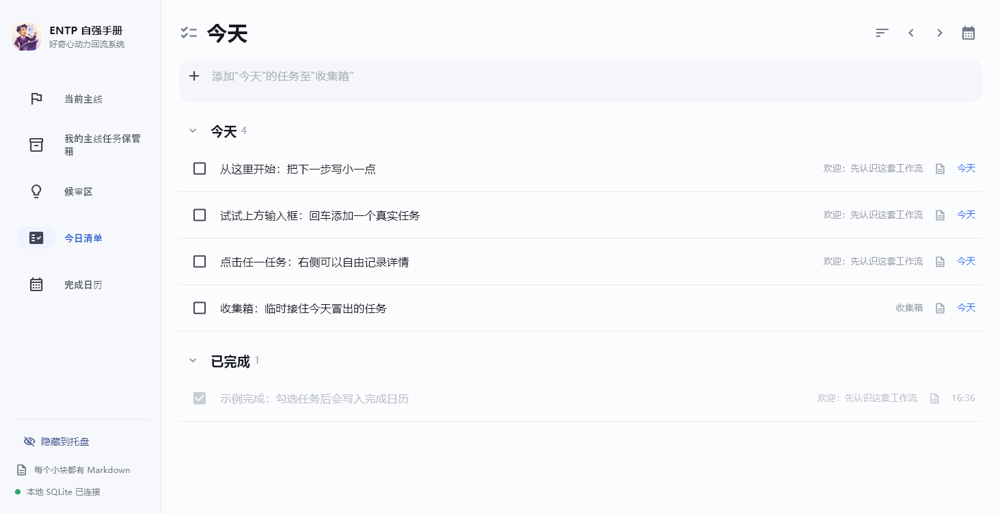

# ENTP 自强手册

<p align="center">
  
</p>

<p align="center">
  <strong>一次只推进一条主线。新想法先记下来，等需要时再整理。</strong>
</p>

<p align="center">
  <a href="https://github.com/TANGuoGUO/entp-manual/releases/latest/download/ENTP-Manual-2.0.0-Setup.exe">下载 Windows 安装版</a>
  ·
  <a href="https://github.com/TANGuoGUO/entp-manual/releases/latest">版本说明</a>
  ·
  <a href="PRODUCT_DESIGN.md">设计文档</a>
</p>

## 它解决什么问题

这个软件主要处理四件事：

1. **想做的事情太多，执行时总在换方向**

   可以保存多条主线，但工作页面只显示当前选择的一条。其他主线放在保管箱里，需要时再切换。

2. **刚开始做事，又被新想法打断**

   在当前页面用一句话记下灵感。它会进入候审区，不会立刻变成任务，也不会把页面切走。

3. **方案想得很完整，现实里却没有进展**

   每个任务都可以写“下一步最小行动”，并逐次记录做了什么、得到什么结果、下一步是什么。

4. **过几天以后，不记得自己哪天完成了什么**

   今日清单按日期保存计划、完成和顺延记录；完成日历保留过去真正发生过的完成事实。

它不要求连续打卡，也不默认设置倒计时。时间限制和复盘日期都是可选项。

## 功能介绍

### 1. 当前主线：执行时只看一个方向


一条主线下可以有多个任务，但页面会突出一个“当前推进”任务。

- 顶部输入框直接创建任务，按回车保存。
- 任务详情可以写自由正文和下一步最小行动。
- “记录一次执行”保存本次行动、结果和新的下一步。
- “暂存新灵感”只记录一句话，不中断当前工作。
- “没动力了”打开候审区，让用户重新查看以前记下的灵感。

其他主线不会和当前主线并排显示。它们统一放在“我的主线任务保管箱”中，可以切换、归档和恢复。归档不会删除任务或 Markdown。

### 2. 候审区：新想法先放这里


候审区不是第二个任务清单。灵感刚记下来时，不需要决定它是否有用，也不需要马上关联主线。

- **未审视**：刚记录，还没有处理。
- **待孵化**：仍然感兴趣，但现在不开始。
- **正在尝试**：愿意为它做一次小实验。
- **已归档**：暂时不看；内容仍然保留，可以恢复。

卡片底部的小图标可以直接完成孵化、尝试或归档。展开卡片后，只有标题、标签和一张空白 Markdown 记录页，没有预设问题和固定分类。

候审区不要求每天清空。用户可以只在没动力、准备换方向或想重新整理兴趣时打开它。

### 3. 今日清单：记录今天准备做什么



今日清单汇总所有主线和收集箱中的当日任务。

- 输入一句话并按回车，可以把任务加入今天的收集箱。
- 支持完成、恢复、分组折叠和优先级排序。
- 支持查看前一天、后一天或从月历选择日期。
- 过期任务由用户决定是否顺延，不会在第二天自动改成“今天”。

任务后来改名，过去的每日账本仍保留当时的标题和所属主线。

### 4. 完成日历：查看哪天真正做完了什么


任务勾选完成后，会在当天留下完成时间。点击日历中的日期，可以查看当天完成的任务。

如果以后重新打开这个任务，过去的完成记录仍然存在。日历记录的是历史事实，不是任务此刻的状态。

### 5. Markdown、备份和本地数据

数据保存在本机 SQLite。每条主线、任务、灵感、执行记录和每日账本还会生成独立 Markdown 文件：

```text
markdown/
├─ 主线/
├─ 任务/
├─ 思路/
├─ 执行记录/
└─ 每日/
```

程序只更新文档中的系统区，系统区以外的正文不会被覆盖。文件可以交给 MarkText 或系统默认的 Markdown 软件编辑。

“导出全部”会生成 `.entp.zip`，其中包含数据库、Markdown 和校验清单。导入前，程序会先备份当前工作区。

## 第一次打开怎么用

初始化版内置了一组介绍数据。它们不是截图或弹窗，而是真正的主线、任务、灵感和完成记录，可以直接操作。

建议先做四步：

1. 在“当前主线”顶部添加一个自己的任务。
2. 打开任务详情，把下一步写成一个现在能开始的小动作。
3. 做一点以后，点击“记录一次执行”。
4. 中途想到别的事情时，用“暂存新灵感”记一句话，然后继续当前任务。

示例内容可以修改、完成或归档。它只在数据库为空时生成一次，不会覆盖已有数据。

## 这些设计参考了哪些心理学研究

下面的研究用于解释设计选择，不代表软件已经证明能改善所有人的执行能力，也不代表 ENTP 是一种临床分类。

### 目标竞争：为什么执行页只显示一条主线

目标屏蔽（goal shielding）研究讨论了一个正在追求的目标如何抑制其他目标的干扰。当前主线和主线保管箱采用了相同的思路：允许其他目标存在，但不让它们一直出现在执行页面。

参考：Shah、Friedman 与 Kruglanski，[Forgetting All Else: On the Antecedents and Consequences of Goal Shielding](https://doi.org/10.1037/0022-3514.83.6.1261)，2002。

### 注意残留：为什么不鼓励在任务之间来回切换

从未完成的任务切换到另一个任务后，一部分注意仍可能停留在前一个任务上，影响后续表现。软件因此把其他主线移到保管箱，并让新灵感先快速记录，而不是马上展开。

参考：Sophie Leroy，[Why Is It So Hard to Do My Work? The Challenge of Attention Residue When Switching Between Work Tasks](https://doi.org/10.1016/j.obhdp.2009.04.002)，2009。

### 认知卸载：为什么新想法可以先写下来

认知卸载（cognitive offloading）指的是借助纸张、设备或动作，把一部分记忆和信息处理要求转移到外部环境。把灵感写下来，可以减少“必须一直记着它”的负担。这里的目的只是保存，不是立即判断和整理。

参考：Risko 与 Gilbert，[Cognitive Offloading](https://doi.org/10.1016/j.tics.2016.07.002)，2016。

### 实施意图：为什么任务需要具体的下一步

实施意图研究关注“在什么情况下，采取什么行动”这种具体计划。相比只写一个抽象目标，明确行动条件和动作更容易启动行为。软件中的“下一步最小行动”借鉴了这个方向，但当前字段不是一套严格的“如果—那么”计划工具。

参考：Gollwitzer 与 Sheeran，[Implementation Intentions and Goal Achievement: A Meta-analysis of Effects and Processes](https://doi.org/10.1016/S0065-2601(06)38002-1)，2006。

### 新奇刺激：为什么新灵感很容易抢走注意

有关新奇刺激的研究发现，人脑的 SN/VTA 等区域会对新刺激作出反应，新奇性也与学习和探索有关。这能解释为什么新想法可能比已经熟悉的任务更有吸引力。候审区没有消灭这种兴趣，只是把“记录新想法”和“马上换任务”分开。

这项研究针对一般的新奇加工，不能用来证明某种人格类型具有特定脑机制。

参考：Bunzeck 与 Düzel，[Absolute Coding of Stimulus Novelty in the Human Substantia Nigra/VTA](https://doi.org/10.1016/j.neuron.2006.06.021)，2006。

## 项目的范围

最初的产品研究还讨论过情绪表达、沟通方式、7/14/30 天承诺周期和周期复选。这些内容没有完整进入 2.0：

- 情绪翻译器和对话模式识别尚未开发。
- 承诺期限与复盘日期已有数据基础，但当前界面没有完整流程，而且默认关闭。
- 灵感关联、执行记录和转任务已有部分数据能力，当前 Flet 页面尚未全部开放。

当前版本只完成“选择一条主线—记录新灵感—继续执行—按日期保存结果”这条流程。README 不把规划中的方向写成已有功能。

## 下载和安装

[直接下载 Windows 安装版](https://github.com/TANGuoGUO/entp-manual/releases/latest/download/ENTP-Manual-2.0.0-Setup.exe)

安装时可以选择安装目录、桌面快捷方式，以及是否在登录 Windows 后于后台启动。程序支持系统托盘隐藏和标准 Windows 卸载。

安装版的用户数据保存在：

```text
%LOCALAPPDATA%\ENTP自强手册
```

卸载默认保留数据库和 Markdown，避免误删个人记录。详细说明见 [WINDOWS_INSTALLER.md](WINDOWS_INSTALLER.md)。

## 从源码运行

环境：Windows、Python 3.12。

```powershell
git clone https://github.com/TANGuoGUO/entp-manual.git
cd entp-manual
python -m venv .venv
.\.venv\Scripts\python.exe -m pip install -r requirements-flet.txt
.\.venv\Scripts\python.exe flet_app.py
```

运行测试：

```powershell
.\.venv\Scripts\python.exe -m unittest discover -s tests -p "test_*.py"
```

构建安装包需要 Inno Setup 6，具体命令见 [WINDOWS_INSTALLER.md](WINDOWS_INSTALLER.md)。测试设计和报告见 [TEST_PLAN.md](TEST_PLAN.md) 与 [TEST_REPORT.md](TEST_REPORT.md)。第三方组件及许可证说明见 [THIRD_PARTY_NOTICES.md](THIRD_PARTY_NOTICES.md)。
